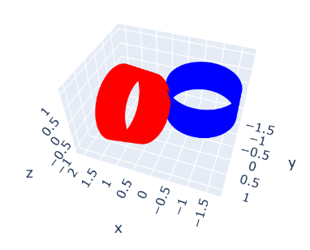

# Analytical Collision Detection for Cylindrical Rigid Bodies

## Introduction
This repository contains the code for the analytical collision detection between cylindrical rigid bodies. It is a reproduction of the method described in the paper [Collision detection of cylindrical rigid bodies for motion planning](https://ieeexplore.ieee.org/document/1641925).

> This algorithm uses line geometry and dual number algebra to exploit the geometry of right circular cylindrical objects to facilitate the detection of collisions. 

## Quick Start
The code is written in Python 3.7. To run the code, you need to install the following packages:
- numpy
- scipy

The `test.ipynb` notebook contains a simple example of the collision detection between two cylinders. You will need to define the parameters of the two cylinders in dictionary format:
```python
cylinder1 = {
    "direct": np.array([1, 1, 1]),
    "center": np.array([1, 0, 0]),
    "radius": 1,
    "height": 1
}
cylinder2 = {
    "direct": np.array([0, 0, 1]),
    "center": np.array([-0.75, -0.9, 0]),
    "radius": 1,
    "height": 1
}
```
The notebook will visualize the two cylinders and the collision detection result:

Then you can call the `check_collision` function to check if the two cylinders collide:
```python
check_collision(cylinder1, cylinder2)
```
It will return `True` if the two cylinders collide, otherwise it will return `False`.

## Reference
[1] J. Ketchel and P. Larochelle, “Collision detection of cylindrical rigid bodies for motion planning,” in Proceedings 2006 IEEE International Conference on Robotics and Automation, 2006. ICRA 2006., Orlando, FL, USA: IEEE, 2006, pp. 1530–1535. doi: 10.1109/ROBOT.2006.1641925.

## TODO
- [ ] There are bugs remaining when the central axis of the cylinder are coplanar.